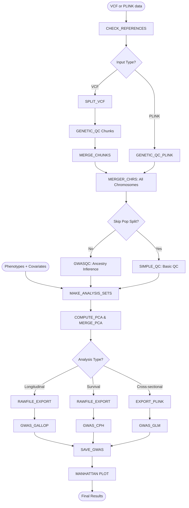

> **Note:**
This repository is underdevelopment. The documents in the `./docs/` folder are from previous versions and may be outdated. Please refer to the README.md for the latest information.**

# longitudinal-GWAS-pipeline

Repository for Nextflow pipeline to perform GWAS with longitudinal capabilities

## Workflow Overview

This pipeline supports three types of genetic association analyses:
- **Cross-sectional** (GLM): Standard GWAS with single time-point phenotypes
- **Longitudinal** (GALLOP/LMM): Repeated measures analysis with time-varying phenotypes
- **Survival** (Cox PH): Time-to-event analysis


**Pipeline stages:**
```
Input: VCF files + Phenotypes + Covariates
  ↓
Stage 1: Genetic QC (filtering, normalization, merging)
  ↓
Stage 2: Data Preparation (sample QC, Analysis set creation, PCA)
  ↓
Stage 3: GWAS Execution (GLM/GALLOP/CPH)
  ↓
Output: Association statistics + Manhattan plots
```


## graphic overview



## Starting Guide

### Prerequisites

- **Nextflow** >= 21.04.0 (DSL2 required) and < 26.04.0
  ```bash
  # Check your version
  nextflow -version
  
  # Install/update Nextflow
  curl -s https://get.nextflow.io | bash
  ```
- **Docker** or **Singularity** (for containerized execution)
  - Docker Desktop (Mac/Windows) or Docker Engine (Linux)
  - OR Singularity/Apptainer (HPC environments)

> **Important (Parser Compatibility):**
> - **Nextflow 26.04+**: set parser mode explicitly before running:
>   ```bash
>   export NXF_SYNTAX_VERSION=v1
>   ```
>   or prefix each command:
>   ```bash
>   NXF_SYNTAX_VERSION=v1 nextflow run main.nf -profile standard -params-file conf/examples/test_survival.yml
>   ```

### Clone Repository

```bash
git clone https://github.com/hirotaka-i/long-gwas-pipeline.git
cd long-gwas-pipeline
# Update to latest code if needed
git pull origin main  
```

### Reference Folder Setup

The `References/` folder contains reference genome FASTA files and chain files for liftover (to Hg38). They are required to be placed in the directory specified by the `reference_dir` parameter (default: `./References/`) with the following structure. 

```
<reference_dir>/ # Directory specified by `reference_dir` parameter. Default: `./References/`
├── Genome/
│   ├── hg38.fa.gz
│   ├── hg38.fa.gz.fai
│   ├── hg19.fa.gz
│   └── hg19.fa.gz.fai
└── liftOver/
    ├── hg19ToHg38.over.chain.gz
    └── hg18ToHg38.over.chain.gz
```

For example, if your target genotyping data is hg19, you can download required files using the provided script:
```bash
bin/download_references.sh hg19 References
```

### Script and Module Folders

- `bin/`: Pipeline scripts (auto-mounted into containers)
- `modules/`: Nextflow modules for each pipeline stage

Nextflow automatically mounts these directory into containers and adds it to PATH. This means you can modify Python, R, shell and workflow scripts without rebuilding the container. The container is the working environment with all dependencies pre-installed but the actual scripts are in these directories.

### Example Data and Codes
[./example/](./example/) folder has the following structure. Please follow the format for your own input files.
```
example/
├── genotype/          # Example VCF files (chr20-22)
├── genotype_plink/    # Example PLINK files converted from VCFs
├── covariate.csv      # Example covariate file     
├── phenotype.cs.tsv   # Example cross-sectional phenotype file
├── phenotype.lt.tsv   # Example longitudinal phenotype file (continuous)
└── phenotype.surv.tsv # Example longitudinal phenotype file (survival)
```

### Configuration
The pipeline is highly configurable. ./conf/ folder has configuration files for profiles and parameters.
```
conf/
├── examples/    # Example parameter YAML files for different analytical modes using example dataset
├── profiles/    # Profile configurations for different execution environments (local, biowulf, gcb, etc)
├── base.config  # Base configuration file common to all profiles
└── param.config # All the paramaters with default values and explanations
```

#### Parameter Configurations


For all the paramaters, see [conf/params.config](conf/params.config). 

[./conf/examples/](./conf/examples/) has example parameter YAML files for different analytical modes using the example dataset.


#### Profile configurations
The pipeline has pre-defined profiles for different execution environments. You can specify the profile using the `-profile` flag. Available profiles include:
- `standard`: Local execution with Docker
- `localtest`: Local execution with locally built Docker image (for development/testing)
- `biowulf`: Biowulf cluster execution with Singularity
- `biowulflocal`: Biowulf local execution without job submission
- `gcb`: Google Cloud Batch execution (for Verily Workbench)

These profiles can be customized in [conf/profiles/](conf/profiles/) folder.


### Output Directory Structure

After running the pipeline, the output directory structure under `STORE_ROOT/PROJECT_NAME/` will look like this:

```
$STORE_ROOT/
└── $PROJECT_NAME/
    ├── genotypes/
    │   └── ${genetic_cache_key}/        # e.g., vcf_EUR_hg38_maf0.05_kin0.177_skip
    │       └── chromosomes/             # Reused across all analyses with same genetic parameters
    │           ├── chr1.pgen/pvar/psam  # Chromosome-level variant QCed / standardized PLINK2 binaries
    │           ├── chr2.pgen/pvar/psam
    │           └── ...
    │
    ├── analyses/
    │   └── ${genetic_cache_key}/        # Genetic_cache_key of the genetic input used
    │       ├── genetic_qc/              # Sample QC step. Shared across analyses with same genetics.
    │       │   ├── merged_genotypes/    # Chromosome-merged PLINK files (Ready for pop_split/sample_qc)
    │       │   └── sample_qc/           # Sample QC results
    │       │
    │       └── ${analysis_name}/        # Analysis-specific outputs (phenotype/model specific)
    │           ├── prepared_data/       # Analysis-specific data preparation. E.g. study_arm split, PCs
    │           └── gwas_results/        # GWAS results
    │
    └── work/                            # Nextflow work directory (Can be deleted after project completion)
```

**Environment variables:**
- `STORE_ROOT`: Root directory for all pipeline data - can be local path or GCS bucket (default: `$PWD`)
- `PROJECT_NAME`: Unique identifier for your project (default: `unnamed_project`)

**Parameter defined key components:**
- `genetic_cache_key` = `${format}_${ancestry}_${assembly}_maf${MAF}_kin${kinship}_${skip_suffix}`
  - Example: `vcf_EUR_hg38_maf0.05_kin0.177_skip`
    - `format`: vcf, pgen, or bed (input file type)
    - `ancestry`: e.g., EUR, AFR, ALL (as specified in params)
    - `assembly`: hg19 or hg38
    - `MAF`: Minor allele frequency threshold (e.g., 0.01, 0.05)
    - `kinship`: Kinship threshold used for sample QC (e.g., 0.0884, 0.177)
    - `skip_suffix`: `skip` if `skip_pop_split` is true, otherwise omitted
  
- `analysis_name`: From your YAML params file (default: `unnamed_analysis`)

## Running the Pipeline

**Note**: 
* PLINK files can be an input if they are chromosome separated. But VCF input is preferred as the VCF workflow has multi-alellic splitting, ref/alt-aware liftover, imputation quality filtering and more parallelization. 
* The plink file naming convention should be not using dots before pgen/pvar/psam extensions to avoid confusion with chromosome names. For example, `chr20_dose.pgen` instead of `chr20.dose.pgen`.

### Set Environment Variables
```
export STORE_ROOT='path/to/store_root'    # Default $PWD. Can be GCS bucket for cloud runs
export PROJECT_NAME='my_gwas_test'        # Unique project identifier
```

### Preparation of `Reference` folder. 

### Execution
#### Local Execution (from cloned repository)

```bash
# Basic test survival run with example data
nextflow run main.nf -profile standard -params-file conf/examples/test_survival.yml
```
Now you can customize `params.yml` with your own input files and parameters. see `conf/examples/` for more examples.

#### Local Execution with local Docker Image (For development and testing)

```bash
# Build local Docker image first
docker build --platform linux/amd64 -f Dockerfile.ubuntu22 -t longgwas-local-test .
# Run with localtest profile
nextflow run main.nf -profile localtest -params-file conf/examples/test_survival.yml
```

#### Biowulf
Please read the official Biowulf Nextflow guide first: https://hpc.nih.gov/apps/nextflow.html

```bash
module load singularity
module load nextflow

# Build Singularity image from Dockerhub image
mkdir -p ./Docker
cd ./Docker

export NXF_SINGULARITY_CACHEDIR=/data/$USER/nxf_singularity_cache;
export SINGULARITY_CACHEDIR=/data/$USER/.singularity;

singularity build long-gwas-pipeline.sif docker://ghcr.io/hirotaka-i/long-gwas-pipeline:latest
cd ..

# Submit the slurm job from the main directory
nextflow run main.nf -profile biowulf -params-file conf/examples/test_survival.yml

# or local
nextflow run main.nf -profile biowulflocal -params-file conf/examples/test_survival.yml
```
`biowulf` profile submits jobs to the cluster, but the main node should keep running until the workflow is complete (or submit it as a batch job). `biowulflocal` runs everything on the main node without submitting jobs to the cluster (useful for the small test run).

#### Verily Workbench / Google Cloud Batch
For verily Workbench, first create a GCS bucket to store your data. Then run the following commands from within the Verily Workbench VM. You would need to get a Tower access token from https://cloud.seqera.io/tokens to monitor your runs on Seqera Tower.
```bash
# From within Verily Workbench VM
export STORE_ROOT='gs://<your-bucket-name>'  # Bucket you created above
export PROJECT_NAME='testrun'                # Any name for your project
export TOWER_ACCESS_TOKEN='<your-token>'     # Get from https://cloud.seqera.io/tokens

cd ~/repos/long-gwas-pipeline

git pull origin main  # Update to latest code

wb nextflow run main.nf -profile gcb -params-file conf/examples/test_survival.yml -with-tower
```


#### (In progress) Remote Execution - no clone needed)

```bash
# Run from GitHub main branch
nextflow run hirotaka-i/long-gwas-pipeline -r main -profile standard -params-file myparams.yml

```

### TIPS
* `-resume` flag can be used to resume failed runs. Data modifications and model changes can reuse the cached qced-genetics.
* `-with-dag flowchart.png` will also creates workflow DAG diagram in `flowchart.png`. 
* `-with-tower` flag can be used to monitor runs on Seqera Tower.
* `${projectDir}` points where the main.nf is located. **Relative paths don't work**
* Files to check after running.
  * N of input: `genotypes/${genetic_cache_key}/chromosomes/chr*/*.psam`
  * N of sample_qc: `analyses/${genetic_cache_key}/genetic_qc/sample_qc/*_samplelist_p2out_qc_summary.txt`
  * Analysis sets: `analyses/${genetic_cache_key}/${analysis_name}/prepared_data/*_all.tsv`


### More about Caching and Resume Behavior

The pipeline uses **three complementary caching mechanisms**:

#### 1. Nextflow `-resume` (work directory caching)
Standard Nextflow caching for resuming failed runs:

```bash
nextflow run main.nf -profile standard -params-file params.yml -resume
```

- **Location**: `${STORE_ROOT}/${PROJECT_NAME}/work/`
- **Purpose**: Resume interrupted runs from point of failure
- **Behavior**: Skips completed tasks, re-runs only failed/incomplete tasks
- **Cleanup**: Safe to delete after successful completion to save disk space

#### 2. storeDir (persistent chromosome cache)
Chromosome-level PLINK files are permanently stored for cross-session reuse:

- **Location**: `${STORE_ROOT}/${PROJECT_NAME}/genotypes/${genetic_cache_key}/chromosomes/`
- **Purpose**: Avoid re-processing expensive per-chromosome QC across different runs
- **Behavior**: 
  - If chromosome files exist, processing is **skipped entirely** (no execution)
  - Works **independently of `-resume`** - checked by pipeline logic in `main.nf`
  - Survives even after deleting work directory
- **Cache key includes**: input format (vcf/pgen/bed), ancestry, assembly, MAF, kinship, skip_pop_split
- **Cleanup**: Only delete if you need to reprocess chromosomes from source files

**Example - cumulative genome-wide analysis:**
```bash
# Run 1: Process chr21-22 for testing
input: "genotype/chr{21,22}.vcf"
# → Saved to genotypes/vcf_EUR_hg38_maf0.05_kin0.177/chromosomes/

# Run 2: Process chr17-19 (same genetic_cache_key)
input: "genotype/chr{17,18,19}.vcf"
# → chr21-22 loaded from storeDir (no re-processing)
# → chr17-19 newly processed
# → Analysis includes ALL 6 chromosomes (chr21-22 + chr17-19)
```

**TIPS: Even if you use the different `analysis_name` or change phenotypes, the chromosome-level QC is reused as long as the `PROJECT_NAME` and the genetic parameters are the same.**

#### 3. publishDir + cache 'deep' (merged QC results)
Merged/aggregated results reuse based on **content**, not paths:

- **Location**: `${STORE_ROOT}/${PROJECT_NAME}/analyses/${genetic_cache_key}/genetic_qc/`
- **Purpose**: Merged chromosome results (MERGER_CHRS, SIMPLE_QC) across analyses with different phenotypes
- **Behavior of `deep` Cache**:
  - Uses Nextflow's `cache 'deep'` to hash file **contents**, not paths
  - Reuses results when same genetic data processed, even with different `analysis_name`
  - Example: survival analysis and cross-sectional analysis share same genetic QC if using same chromosomes
  - `publishDir` just has data but not cache. Cache is lost when `work/` is deleted.
- **Why not storeDir**: Merged results depend on **which** chromosomes are selected (chr1-22 vs chr21-22), so need flexible work directory caching


**Key distinctions:**

| Mechanism | Location | Persists after `work/` cleanup? | Reused across analyses? | When to clear |
|-----------|----------|--------------------------------|------------------------|---------------|
| **work/ + `-resume`** | `work/` | ❌ No | ❌ No | After successful run |
| **storeDir** | `genotypes/.../chromosomes/` | ✅ Yes | ✅ Yes | When reprocessing source chromosomes |
| **publishDir + cache 'deep'** | `analyses/.../genetic_qc/` | ❌ No (but republished) | ✅ Yes (via cache) | When changing QC parameters |

**Best practices:**
- Use `-resume` to recover from failures
- Keep `genotypes/` directory - contains expensive chromosome-level QC
- Different chromosome sets? Use different `genetic_cache_key` (set via `genetic_data_id` parameter)
- Same genetics, different phenotypes? Pipeline automatically shares genetic QC via `cache 'deep'`

## Appendix
Some handy workflows.


### Focused Analysis (run_focus.nf)

Use `run_focus.nf` for targeted GWAS on a small set of variants of interest, without re-running the full QC/PCA pipeline. Supports GLM, longitudinal (GALLOP), and survival (CPH) modes.

```bash
nextflow run run_focus.nf -profile standard -params-file conf/examples/focus_cs.yml
```

**Genotype input (`focus_plink_input`):** A `.pgen` file (with `.pvar`/`.psam`) containing only the variants of interest. Variant IDs will be standardized to `chr:pos:ref:alt` format internally — no need to pre-format them.

**Covariate input (`focus_covar_file`):** Recommended to reuse the `*_filtered.pca.harmonized.tsv` output from a prior `main.nf` run (already QC'd and PCA-appended). If you provide a raw covariate file instead, it will be renamed to `{ancestry}_focus_filtered.pca.tsv` internally so the pipeline can process it — the filename does not need to contain "pca".

**Strata file (`focus_strata_file`, optional):** A tab-separated file that splits the analysis into independent groups (e.g., by ancestry, cohort, or study arm). Each stratum runs as a separate GWAS job.

```
#FID    IID     STRATA
0       ID001   GROUP1
0       ID002   GROUP1
0       ID003   GROUP2
```

If omitted, all samples are analyzed together as a single group.


### METAL Meta-analysis (Standalone)

Use `run_metal.nf` when you already have long-gwas-outputs that you want meta-analysis.

Expected input columns (tab-delimited): `ID(chr:pos:ref:alt)`, `REF`, `ALT`, `A1`, `BETA`, `SE`, `P`, `OBS_CT`, `A1_FREQ`

If the input is from GWASGALLOP, then modify the `run_metal.nf` to select the correct columns such as `BETAi`, `SEi`, `Pi` for intercept and `BETAs`, `SEs`, `Ps` for slope effect for the variants.

#### Example
Do meta-analysis for survival results of EUR and AJ populations with google cloud batch.

Create `metal_surv.yml` with the following content, replacing `<YOUR_BUCKET>` with your actual GCS bucket name where the input files are located and where you want the output to be stored.
```yml
metal_input: "gs://<YOUR_BUCKET>/EUR_*_SURV_results.tsv.gz,gs://<YOUR_BUCKET>/AJ_*_SURV_results.tsv.gz"
metal_outdir: "gs://<YOUR_BUCKET>/META/SURV"
metal_prefix: "HY_SURV_META"
```

Then run this command to execute the METAL meta-analysis:
```bash
nextflow run metal.nf -profile gcb2 -params-file metal_surv.yml
```

Or run directly:
```bash
nextflow run metal.nf -profile gcb2 \
  --metal_input "gs://bucket/path/EUR_*_SURV_results.tsv.gz,gs://bucket/path/AJ_*_SURV_results.tsv.gz" \
  --metal_outdir "gs://bucket/path/META/SURV" \
  --metal_prefix "HY_SURV_META"
```

## Troubleshooting

If the pipeline fails, check the following:
- `.nextflow.log` for general errors. reports (html) are also useful. 
- Check the failed process ID, and review Nextflow logs in `work/` directory for error details.
- Common issues:
  - Input file format errors (VCF/PLINK) --> validate input files
  - Missing reference files --> download using provided script `bin/download_references.sh`
  - Insufficient resources (memory/CPU) --> adjust resource parameters in the profile configs

If pipeline ran succssessfully but results look off:
- Check the number of jobs in each process
- Verify input sample and variant counts in `genotypes/${genetic_cache_key}/chromosomes/chr*/.psam` files.
- Check sample QC summaries in `analyses/${genetic_cache_key}/genetic_qc/sample_qc/` to ensure expected sample counts after QC.
- Review PCA plots in `prepared_data/` to confirm population structure.
- Check the analyzed phenotypes and covariates in `prepared_data/` to ensure correct data preparation.
- Review model specifications in the .command files by checking the `work/` directory for the GWAS execution step.


## Support

For issues and questions:
- 🐛 **Bug reports**: [GitHub Issues](https://github.com/hirotaka-i/long-gwas-pipeline/issues)
- 💬 **Discussions**: [GitHub Discussions](https://github.com/hirotaka-i/long-gwas-pipeline/discussions)


## Appendix for Docker Image Maintenance
Docker images are built automatically via GitHub Actions. 

Local Docker image maintenance instructions are below.
```
# Weekly maintenance - safe - keeps tagged images, removes build cache
docker system prune -f

# After major builds - more aggressive - removes all unused images
docker builder prune -a -f

# Nuclear option - rarely - use with caution
docker system prune -a -f --volumes  # Only when you know what you're doing
```
